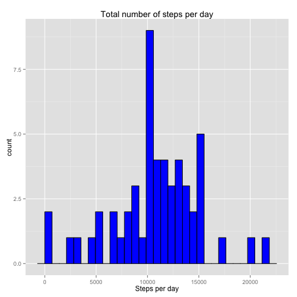
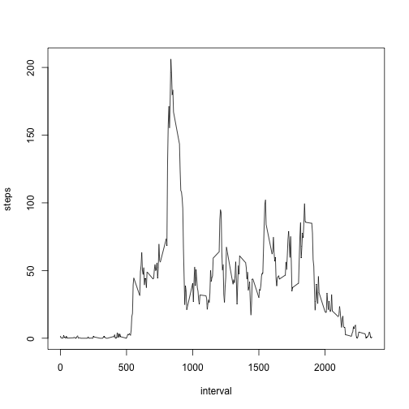
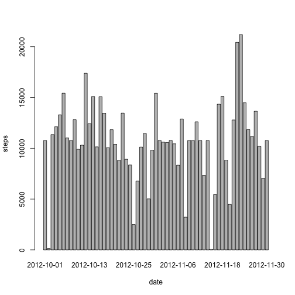
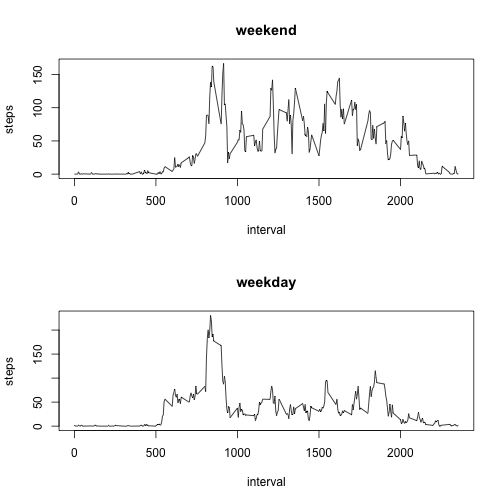

# Reproducible Research: Peer Assessment 1

## Loading required libraries

```r
library(plyr)
library(ggplot2)
```

## Loading and preprocessing the data

```r
setwd("/Users/shearora/Desktop/")
activity <- read.csv("activity.csv", header = TRUE)
activity <- transform(activity, date = as.Date(date))
```


## What is mean total number of steps taken per day?
Find the total number of steps taken per day.

```r
stepsPerDay <- ddply(activity, ~date, summarise, steps = sum(steps))
```

Plot a histogram of the total number of steps taken per day.

```r
plot <- ggplot(stepsPerDay,aes(steps))
plot <- plot + geom_histogram(fill = "blue", color = "black")
plot <- plot + ggtitle("Total number of steps per day")
plot + xlab("Steps per day")
```

```
## stat_bin: binwidth defaulted to range/30. Use 'binwidth = x' to adjust this.
```

 

Calculate the mean and median of the total number of steps taken per day

```r
meansteps <- mean(stepsPerDay$steps,na.rm=TRUE)
mediansteps <- median(stepsPerDay$steps,na.rm=TRUE)
```
The mean of steps is 10766.19

The median of steps is 10765

## What is the average daily activity pattern?
Find the average number of steps taken per 5 minute interval.

Time series plot of the 5-minute interval (x-axis) and the average number of steps taken, averaged across all days (y-axis)


```r
steps.interval <- aggregate(steps ~ interval, data = activity, FUN = mean)
plot(steps.interval, type = "l")
```

 

Maximum number of Steps in 5-minute interval

```r
steps.interval$interval[which.max(steps.interval$steps)]
```

```
## [1] 835
```

## Imputing missing values

Total number of missing values in the dataset


```r
sum(is.na(activity))
```

```
## [1] 2304
```

Strategy for filling in all of the missing values in the dataset

Using mean to fill the missing valeus.


```r
activity <- merge(activity, steps.interval, by = "interval", suffixes = c("",  ".y"))
nas <- is.na(activity$steps)
activity$steps[nas] <- activity$steps.y[nas]
activity <- activity[, c(1:3)]
```

Make a histogram of the total number of steps taken each day


```r
steps.date <- aggregate(steps ~ date, data = activity, FUN = sum)
barplot(steps.date$steps, names.arg = steps.date$date, xlab = "date", ylab = "steps")
```

 

Calculate and report the mean and median total number of steps taken per day


```r
mean(steps.date$steps)
```

```
## [1] 10766.19
```

```r
median(steps.date$steps)
```

```
## [1] 10766.19
```

The impact is low as mean and median are not changed a lot after filling in the missing values

## Are there differences in activity patterns between weekdays and weekends?

Create a new factor variable in the dataset with two levels – “weekday” and “weekend” indicating whether a given date is a weekday or weekend day.


```r
daytype <- function(date) {
    if (weekdays(as.Date(date)) %in% c("Saturday", "Sunday")) {
        "weekend"
    } else {
        "weekday"
    }
}
activity$daytype <- as.factor(sapply(activity$date, daytype))
```

A panel plot containing a time series plot (i.e. type = "l") of the 5-minute interval (x-axis) and the average number of steps taken, averaged across all weekday days or weekend days (y-axis). 


```r
par(mfrow = c(2, 1))
for (type in c("weekend", "weekday")) {
    steps.type <- aggregate(steps ~ interval, data = activity, subset = activity$daytype == 
        type, FUN = mean)
    plot(steps.type, type = "l", main = type)
}
```

 
